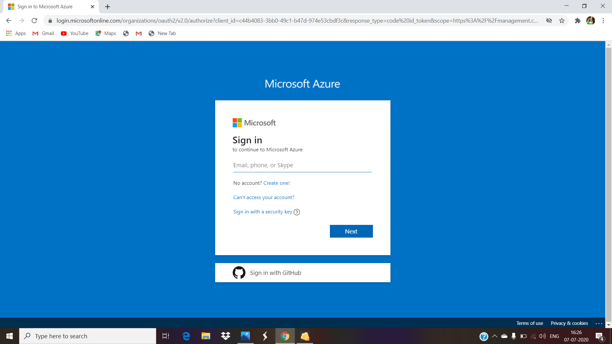
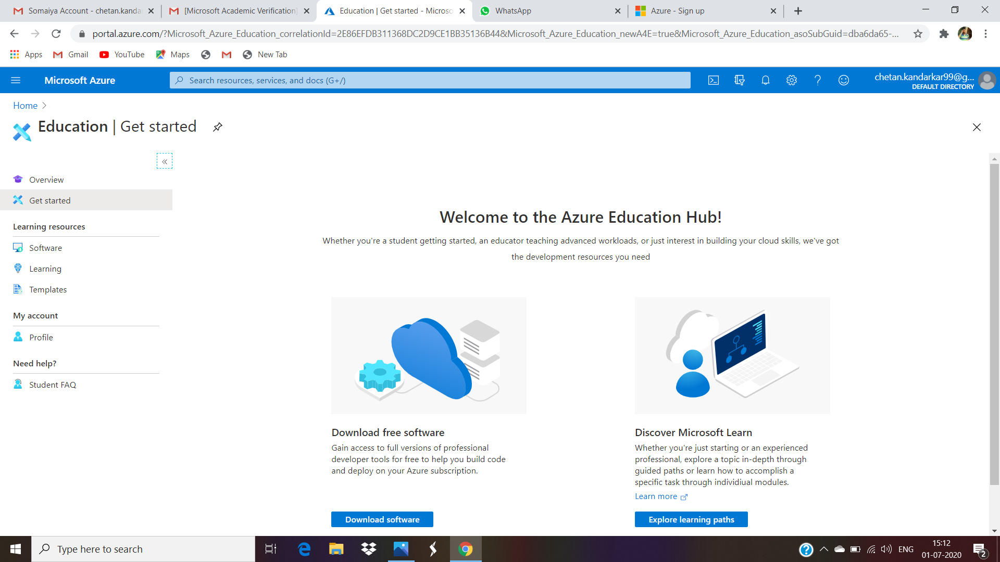

# Microsoft-Azure-IoT-Project
Visualize the real-time temperature and humidity data gathered from stream analytics job through Azure web service or power BI.

## Objective :
Create a stream analytics job in azure IOT. sensors collect data from various devices ,store or sends them over cloud

## Tasks : 
1. Send the temperature and humidity data from the Raspberry pi emulator to the IoT hub.
2. Create a stream analytics job to analyse the real-time data.
3. Visualize the real-time temperature and humidity data gathered from stream analytics job through Azure web service or power BI.

## Block Diagram :

## Prerequisites :
-	A Raspberry Pi Emulator
-	An Azure subscription
-	An IoT Hub (Tip: Choose the Free Tier which allows 8,000 messages per day)
-	A Stream Analytics resource
-	A Power BI account

## About

#### Internet of Things :

The internet of things, or IoT, is a system of interrelated computing devices, mechanical and digital machines, objects, animals or people that are provided with unique identifiers (UIDs) and the ability to transfer data over a network without requiring human-to-human or human-to-computer interaction. IoT is the most promising sector that has evolved over a decade and provided automation that has made our day to day life simple and more comfortable. From switching on and off AC at home using a mobile application, Asking Alexa to change the colour of living room light to alerting automated boilers at industrial plants. IoT has created an impact everywhere.
An IoT system consists of sensors/devices which “talk” to the cloud through some kind of connectivity. Once the data gets to the cloud, software processes it and then might decide to perform an action, such as sending an alert or automatically adjusting the sensors/devices without the need for the user.

#### Azure IoT :

The Azure Internet of Things (IoT) is a collection of Microsoft-managed cloud services that connect, monitor, and control billions of IoT assets. In simpler terms, an IoT solution is made up of one or more IoT devices that communicate with one or more back-end services hosted in the cloud. Azure IoT hub is a managed IoT service which is hosted in the cloud. It allows bi-directional communication between IoT applications and the devices it manages. This cloud-to-device connectivity means that you can receive data from your devices, but you can also send commands and policies back to the devices.
Learning about these platforms and services is now essential to progress your career in IoT. IoT is not limited to hardware but enhancing the hardware capabilities using software backed by cloud technology.

#### Raspberry Pi :

The Raspberry Pi is a series of small single-board computers developed in the United Kingdom by the Raspberry Pi Foundation to promote teaching of basic computer science in schools and in developing countries. The original model became far more popular than anticipated, selling outside its target market for uses such as robotics. It now is widely used even in research projects, such as for weather monitoring because of its low cost and portability. It does not include peripherals (such as keyboards and mouse) or cases.
If we do not having Raspberry Pi Hardware Kit than also we can Install Raspbian OS in PC. This is use as Raspberry Pi Emulator in computer.

## Step To Install Raspbian OS without Hardware kit :
1.	Install VM Virtual Box in our computer. Using [https://www.virtualbox.org/wiki/Downloads](https://www.virtualbox.org/wiki/Downloads)
2.	Download Raspbian Operating System ISO file from [https://www.raspberrypi.org/downloads/raspberry-pi-desktop/](https://www.raspberrypi.org/downloads/raspberry-pi-desktop/)
3.	Now open ISO file in VM Virtual Box and install Raspbian.

## Implementation

### Step 1:
Create Microsoft Azure Account

1) Create free Microsoft azure account using credit card details:
- Open [https://azure.microsoft.com/en-in/free/](https://azure.microsoft.com/en-in/free/)
- Enter your email address and create an account.
- Fill the information and mobile number. you will get otp on it.
- Now enter your Credit card (Visa/Mastercard only) details .
- It is only for verify your account .
- They won’t be charged unless you choose to upgrade.
- After activate your account you will get 12 months of free service.

2) Create free Microsoft azure account using Education email address :
- Open [https://azure.microsoft.com/en-in/free/students/](https://azure.microsoft.com/en-in/free/students/)
- Enter your email address and create an account.
- Fill the information and mobile number. you will get otp on it.
- Now enter your Education email address they will send email you verification link.
- You will get $100 credit point on your free azure account.

## Step 2 :
Create an IoT hub :

1.	Sign in to the Azure portal.
2.	From the Azure homepage, select the + Create a resource button, and then enter IoT Hub in the Search the Marketplace field.
3.	Select IoT Hub from the search results, and then select Create.
4.	On the Basics tab, complete the fields as follows:
-	Subscription: Select the subscription to use for your hub.
-	Resource Group: Select a resource group or create a new one. To create a new one, select Create new and fill in the name you want to use. To use an existing resource group, select that resource group.
-	Region: Select the region in which you want your hub to be located. Select the location closest to you. Some features, such as IoT Hub device streams, are only available in specific regions. For these limited features, you must select one of the supported regions.
-	IoT Hub Name: Enter a name for your hub. This name must be globally unique. If the name you enter is available, a green check mark appears.

5.	Select Next: Size and scale to continue creating your hub
6.	Select Next: Tags to continue to the next screen.
7.	Select Next: Review + create to review your choices. You see something similar to this screen, but with the values you selected when creating the hub
8.	Select Create to create your new hub. Creating the hub takes a few minutes.

