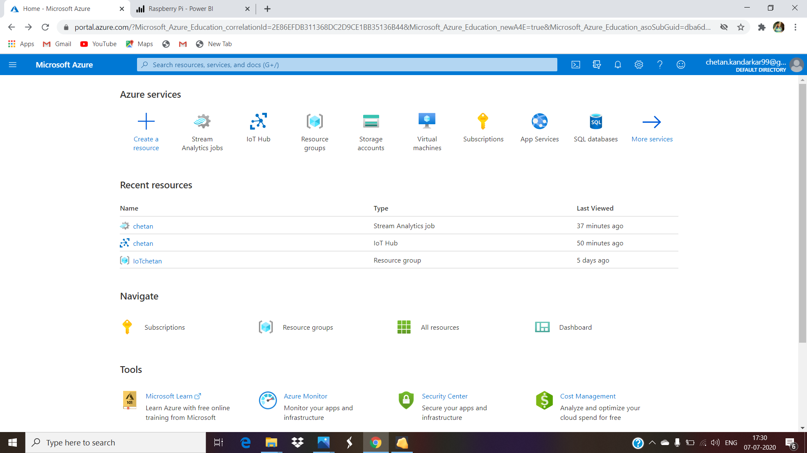
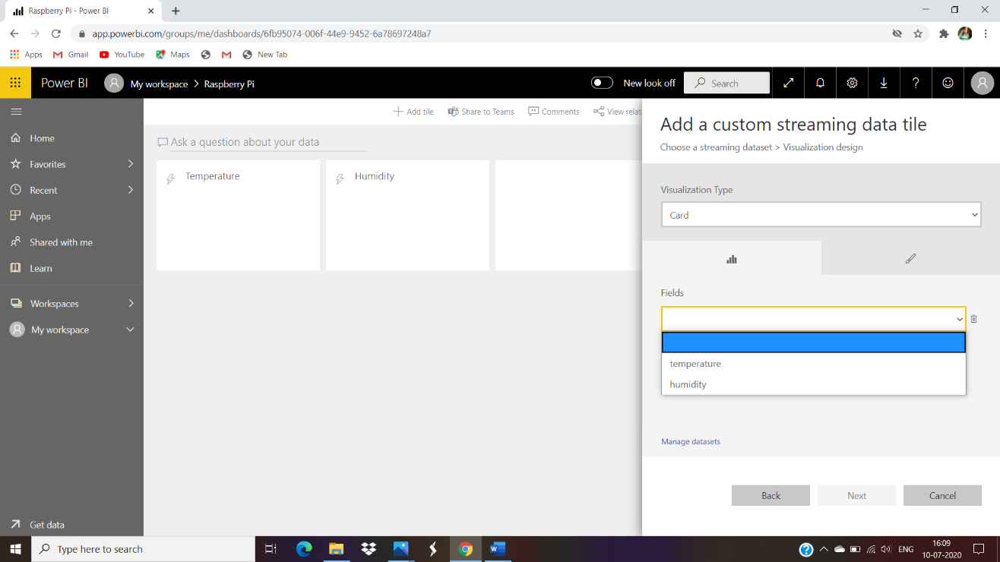

# Microsoft-Azure-IoT-Project
Visualize the real-time temperature and humidity data gathered from stream analytics job through Azure web service or power BI.

## Objective :
Create a stream analytics job in azure IOT. sensors collect data from various devices ,store or sends them over cloud

## Tasks : 
1. Send the temperature and humidity data from the Raspberry pi emulator to the IoT hub.
2. Create a stream analytics job to analyse the real-time data.
3. Visualize the real-time temperature and humidity data gathered from stream analytics job through Azure web service or power BI.

## Block Diagram :

## Prerequisites :
-	A Raspberry Pi Emulator
-	An Azure subscription
-	An IoT Hub (Tip: Choose the Free Tier which allows 8,000 messages per day)
-	A Stream Analytics resource
-	A Power BI account

## About

#### Internet of Things :

The internet of things, or IoT, is a system of interrelated computing devices, mechanical and digital machines, objects, animals or people that are provided with unique identifiers (UIDs) and the ability to transfer data over a network without requiring human-to-human or human-to-computer interaction. IoT is the most promising sector that has evolved over a decade and provided automation that has made our day to day life simple and more comfortable. From switching on and off AC at home using a mobile application, Asking Alexa to change the colour of living room light to alerting automated boilers at industrial plants. IoT has created an impact everywhere.
An IoT system consists of sensors/devices which “talk” to the cloud through some kind of connectivity. Once the data gets to the cloud, software processes it and then might decide to perform an action, such as sending an alert or automatically adjusting the sensors/devices without the need for the user.

#### Azure IoT :

The Azure Internet of Things (IoT) is a collection of Microsoft-managed cloud services that connect, monitor, and control billions of IoT assets. In simpler terms, an IoT solution is made up of one or more IoT devices that communicate with one or more back-end services hosted in the cloud. Azure IoT hub is a managed IoT service which is hosted in the cloud. It allows bi-directional communication between IoT applications and the devices it manages. This cloud-to-device connectivity means that you can receive data from your devices, but you can also send commands and policies back to the devices.
Learning about these platforms and services is now essential to progress your career in IoT. IoT is not limited to hardware but enhancing the hardware capabilities using software backed by cloud technology.

#### Raspberry Pi :

The Raspberry Pi is a series of small single-board computers developed in the United Kingdom by the Raspberry Pi Foundation to promote teaching of basic computer science in schools and in developing countries. The original model became far more popular than anticipated, selling outside its target market for uses such as robotics. It now is widely used even in research projects, such as for weather monitoring because of its low cost and portability. It does not include peripherals (such as keyboards and mouse) or cases.
If we do not having Raspberry Pi Hardware Kit than also we can Install Raspbian OS in PC. This is use as Raspberry Pi Emulator in computer.

## Step To Install Raspbian OS without Hardware kit :
1.	Install VM Virtual Box in our computer. Using [https://www.virtualbox.org/wiki/Downloads](https://www.virtualbox.org/wiki/Downloads)
2.	Download Raspbian Operating System ISO file from [https://www.raspberrypi.org/downloads/raspberry-pi-desktop/](https://www.raspberrypi.org/downloads/raspberry-pi-desktop/)
3.	Now open ISO file in VM Virtual Box and install Raspbian.

## Implementation

Step 1:
### Create Microsoft Azure Account

1) Create free Microsoft azure account using credit card details:
- Open [https://azure.microsoft.com/en-in/free/](https://azure.microsoft.com/en-in/free/)
- Enter your email address and create an account.
- Fill the information and mobile number. you will get otp on it.
- Now enter your Credit card (Visa/Mastercard only) details .
- It is only for verify your account .
- They won’t be charged unless you choose to upgrade.
- After activate your account you will get 12 months of free service.

2) Create free Microsoft azure account using Education email address :
- Open [https://azure.microsoft.com/en-in/free/students/](https://azure.microsoft.com/en-in/free/students/)
- Enter your email address and create an account.
- Fill the information and mobile number. you will get otp on it.
- Now enter your Education email address they will send email you verification link.
- You will get $100 credit point on your free azure account.

Step 2 :
### Create an IoT hub :

1.	Sign in to the Azure portal.
2.	From the Azure homepage, select the + Create a resource button, and then enter IoT Hub in the Search the Marketplace field.
3.	Select IoT Hub from the search results, and then select Create.
4.	On the Basics tab, complete the fields as follows:
-	Subscription: Select the subscription to use for your hub.
-	Resource Group: Select a resource group or create a new one. To create a new one, select Create new and fill in the name you want to use. To use an existing resource group, select that resource group.
-	Region: Select the region in which you want your hub to be located. Select the location closest to you. Some features, such as IoT Hub device streams, are only available in specific regions. For these limited features, you must select one of the supported regions.
-	IoT Hub Name: Enter a name for your hub. This name must be globally unique. If the name you enter is available, a green check mark appears.

5.	Select Next: Size and scale to continue creating your hub
6.	Select Next: Tags to continue to the next screen.
7.	Select Next: Review + create to review your choices. You see something similar to this screen, but with the values you selected when creating the hub
8.	Select Create to create your new hub. Creating the hub takes a few minutes.

Step 3:
### Register a new device in the IoT hub :

1. In your IoT hub navigation menu, open IoT Devices, then select New to add a device in your IoT hub.

2. In Create a device, provide a name for your new device, such as myDeviceId, and select Save. This action creates a device identity for your IoT hub.

3. After the device is created, open the device from the list in the IoT devices pane. Copy the Primary Connection String to use later.

Step 4:
### Create a Consumer Group

1. Navigate to Endpoints within your IoT Hub.
2. Click on the Events (messages/events) endpoint.
3. Add a Consumer Group (e.g. streamanalytics consumergroup).
4. Click Save.

Step 5:
### Create Stream Analytics Job 

1.	From the Azure homepage, select the + Create a resource button, and then enter Stream Analytics Job in the Search the Marketplace field.
2.	Select Stream Analytics Job from the search results, and then select Create.
3.	Enter Job name and select Resource group and location.
4.	Select Create to create your new job. Creating the job takes a few minutes.

Step 6:
### Setup Stream Analytics Input

1.	Navigate to Inputs within your Stream Analytics resource
2.	Click Add stream input > IoT Hub
3.	Provide an Input Alias (e.g. iothubinput).
4.	Select the Consumer Group (streamanalytics_consumergroup).
5.	Click Save.

Step 7:
### Setup Stream Analytics Output

1.	Navigate to Outputs.
2.	Click Add > Power BI.

3.	Provide an Output Alias (e.g. powerbioutput).
4.	Provider a Dataset Name (e.g. temperatureDataset).
5.	Provide a Table Name (e.g. temperatureTable).
6.	Click Authorize.
7.	Click Save.

Step 8:
### Install ‘azure-cli-iot-ext’ in Cloud Shell

1.	Open Your IoT hub 
2.	Click on Cloud Shell from upper blue taskbar
3.	Click on bash create
4.	Now Run “az extension add --name azure-cli-iot-ext” command on cloud shell.

Now Click on home so you will see your IoT hub , Resource group and Stream Analytics Job there.

Step 9:
### Run Commands on Raspberry Pi Terminal

Open Raspberry Pi Emulator on VM Virtual Box
Click on Terminal
Run the following command

- sudo pip3 install azure-iot-device
- sudo pip3 install azure-iot-hub
-	sudo pip3 install azure-iothub-service-client
-	sudo pip3 install azure-iothub-device-client

Step 10:
### Create Python File in Raspberry Pi

Run command  “sudo nano simulateddevice.py”
Now enter the code of simulateddevice.py

#### Note: Open your IoT device from IoT hub and copy primary connection string . Paste this string at “CONNECTION_STRING” in the python file. 

After Pasting primary connection string.
Press “ctrl + x” key and then enter y to save the file. 

Step 11:
### Run the Python file

Run the following command in the terminal
#### “sudo python3 simulateddevice.py”

After Successfully Running python file
We see value of temperature and humidity at output.
This value is send to the IoT hub at every 5 seconds.

## Streaming

Step 1:
### Create Query in Stream Analytics Job

1.	Open Query in Stream Analytics Job
2.	Copy and paste "query.sql" into your Stream Analytics Query window.
3.	Click on the ellipsis next to your IoT Hub input and click Sample data from input.
4.	Set duration to 1 minute and click OK.
5.	Click on save query then test query. You will see event_date. temperature, humidity columns at test results.

Step 2:
### Run the Stream Analytics Job

1.	Now click on overview of Stream Analytics Job
2.	Click on start button.
3.	Select Job output start time ‘now’ and click on start.
4.	After some time you will see your job is running

Step 3:
### Create Dashboard on Power BI

1.	Login on POWER BI [https://powerbi.microsoft.com/](https://powerbi.microsoft.com/)
2.	Create a new Dashboard (My Workspace > Create >Dashboard).
3.	Enter Dashboard as you want.

Step 4:
### Add Tiles on Dashboard

Tile 1:

1.	Click Add tile
2.	Click Custom Streaming Data
3.	Click Next.
4.	Select the temperatureDataset and click Next.
5.	Populate the properties

- Visualization Type: Card
- Fields: temperature
- Decimal Places: 2
- Title: Temperature 

Tile 2:

1.	Click Add tile
2.	Click Custom Streaming Data
3.	Click Next.
4.	Select the temperatureDataset and click Next.
5.	Populate the properties

- Visualization Type: Card
- Fields: humidity
- Decimal Places: 2
- Title: humidity 

## Streaming Output

Here we visualize the real-time temperature and humidity data gathered from stream analytics job through Power BI.

  Real-time temperature and humidity data send from Raspberry Pi to the IoT hub at every 5 seconds. This data is stream from azure stream analytics job to the power bi.
We visualize the real-time temperature and humidity data at Power Bi dashboard at every 5 seconds.

Video Demonstration :

[Click Here](https://youtu.be/M1hwA6KAB-k)

Conclusion:

In this project I Create a stream analytics job to analyse the real-time data. In which temperature and humidity data send from the Raspberry pi emulator to the IoT hub. So the real-time temperature and humidity data visualize from stream analytics job through power BI.Internet of things is not limited to hardware but enhancing the hardware capabilities using software backed by cloud technology. Azure IOT is a collection of Microsoft -managed cloud services that connect, monitor and control billions of IOT assets. An IOT solution is made up of one or more iot devices that communicate with one or more backend services hosted in a cloud.

Internet of Things (IoT) envisages overall merging of several “things” while utilizing internet as the backbone of the communication system to establish a smart interaction between people and surrounding objects. Cloud, being the crucial component of IoT, provides valuable application specific services in many application domains. A number of IoT cloud providers are currently emerging into the market to leverage suitable and specific IoT based services. In spite of huge possible involvement of these IoT clouds, no standard cum comparative analytical study has been found across the literature databases. This article surveys popular IoT cloud platforms in light of solving several service domains such as application development, device management, system management, heterogeneity management, data management, tools for analysis, deployment, monitoring, visualization, and research. A comparison is presented for overall dissemination of IoT clouds according to their applicability. Further, few challenges are also described that the researchers should take on in near future. Ultimately, the goal of this article is to provide detailed knowledge about the existing IoT cloud service providers and their pros and cons in concrete form.
